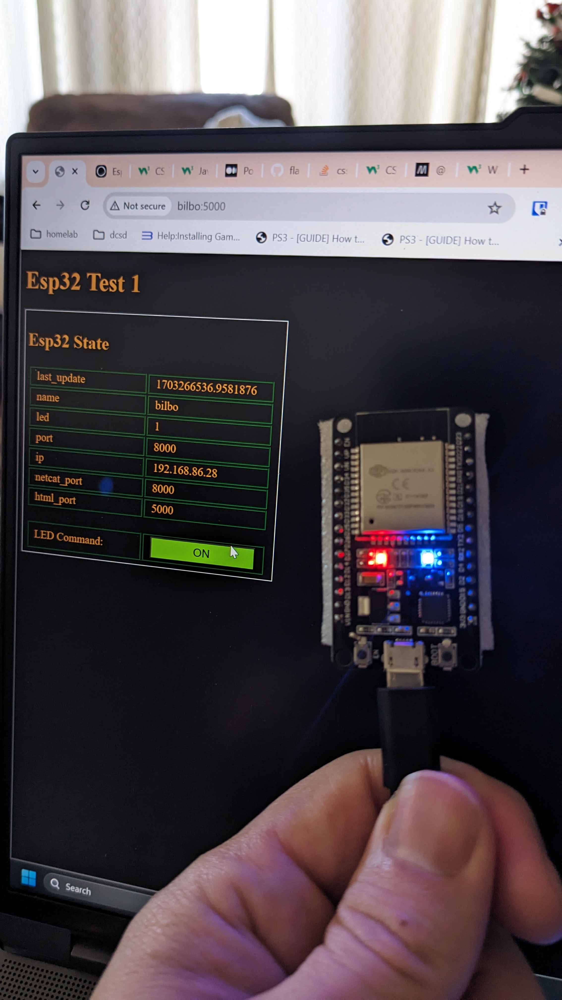

# esp32_projects
Random Esp32 Projects

## blink_led

Starts a web server for the esp32 to connect and you're able to toggle an led.

* `esp32server` - flask web server software
* `TestEsp32` - PlatformIO code for the esp32 device

